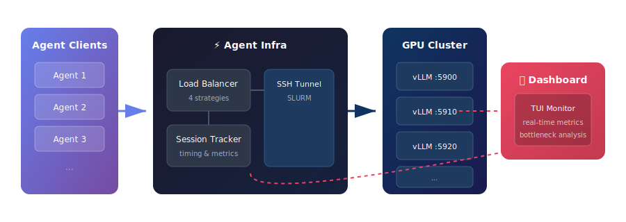
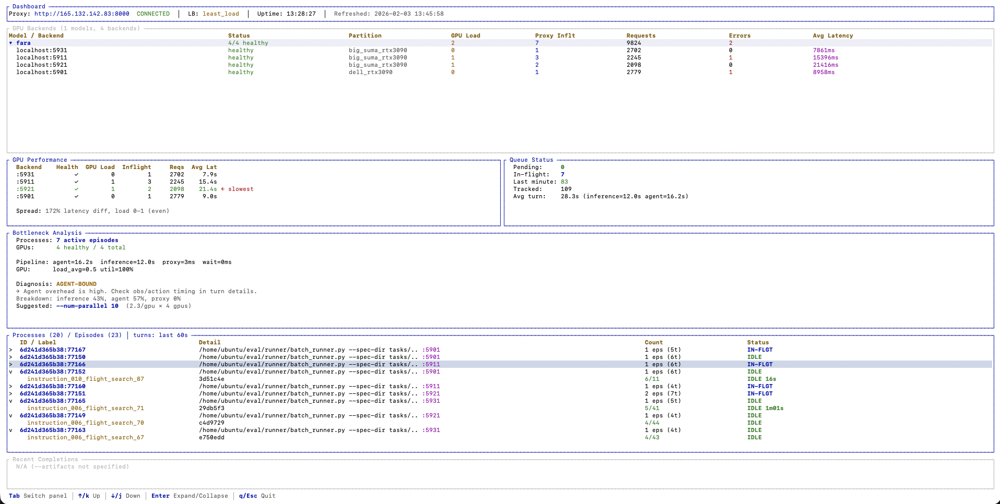

<p align="center">
  <h1 align="center">Agent Infra</h1>
  <p align="center">
    <strong>GPU Serving Infrastructure for Multi-turn LLM Agents</strong>
  </p>
  <p align="center">
    <a href="#features">Features</a> •
    <a href="#installation">Installation</a> •
    <a href="#quickstart">Quickstart</a> •
    <a href="#dashboard">Dashboard</a> •
    <a href="#configuration">Configuration</a>
  </p>
</p>

<p align="center">
  
  
  
</p>

---

## Overview

**Agent Infra** is a production-ready infrastructure for serving LLM backends to multi-turn AI agents. It handles the complexity of GPU cluster management, load balancing, and real-time monitoring so you can focus on building your agent.

<p align="center">
  
</p>

## Features

| Feature | Description |
|---------|-------------|
| **Load Balancing** | 4 strategies: `least_load`, `round_robin`, `least_connections`, `least_latency` |
| **SLURM Integration** | Automatic GPU allocation, job submission, and lifecycle management |
| **SSH Tunneling** | Seamless connectivity to remote GPU nodes |
| **Session Tracking** | Per-request timing, turn-level metrics, bottleneck analysis |
| **Real-time Dashboard** | Rust TUI for monitoring GPU utilization, queue status, and pipeline health |
| **Configurable Headers** | Customizable header names for different agent frameworks |

## Installation

### Python Package

```bash
# Clone the repository
git clone https://github.com/JiHyuk-Byun/agent-infra.git
cd agent-infra

# Install the package
pip install -e .
```

### Dashboard (Optional)

```bash
cd dashboard
cargo build --release

# Binary will be at ./target/release/dashboard
```

## Quickstart

### 1. Create Configuration

```bash
cp configs/example.yaml config.yaml
```

```yaml
# config.yaml
proxy:
  port: 5800
  strategy: least_load

cluster:
  type: slurm
  slurm:
    partitions:
      - name: gpu_partition
        qos: default
        gpus_per_node: 4

models:
  - name: my_model
    model_path: "meta-llama/Llama-3.1-8B-Instruct"
    base_port: 5900
    replicas: 2
    gpu_memory_utilization: 0.85
```

### 2. Launch GPU Servers

```bash
# Submit vLLM jobs to SLURM
agent-infra start --config config.yaml

# Check status
agent-infra status
```

### 3. Start Proxy

```bash
# Create SSH tunnels and start load-balancing proxy
agent-infra connect --config config.yaml
```

### 4. Use in Your Agent

```python
from agent_infra.client import SessionContext
from openai import OpenAI

# Connect to proxy
client = OpenAI(
    base_url="http://localhost:5800/v1",
    api_key="not-needed",
)

# Create session context for tracking
ctx = SessionContext(
    session_id="session-001",
    task_id="task-summarize",
)

# Multi-turn conversation
messages = [{"role": "user", "content": "Hello!"}]

for turn in range(10):
    ctx.set_timing(pre_ms=150.0)  # Track observation build time

    response = client.chat.completions.create(
        model="my_model",
        messages=messages,
        extra_headers=ctx.get_headers(),
    )

    messages.append({
        "role": "assistant",
        "content": response.choices[0].message.content
    })
    messages.append({"role": "user", "content": "Continue."})

    ctx.set_timing(post_ms=200.0)  # Track action execution time
```

### 5. Monitor with Dashboard

```bash
./dashboard/target/release/dashboard --proxy http://localhost:5800
```

### 6. Cleanup

```bash
agent-infra stop --config config.yaml
```

## Dashboard

The real-time TUI dashboard provides comprehensive visibility into your GPU serving infrastructure.

<p align="center">
  
</p>

**Key Panels:**
- **GPU Backends** — Health status, GPU load, in-flight requests, latency per backend
- **Queue Status** — Pending/in-flight counts, throughput metrics
- **Session Tracking** — Per-client and per-session turn details
- **Bottleneck Analysis** — Pipeline timing breakdown, diagnosis, and optimization suggestions

### Keyboard Shortcuts

| Key | Action |
|-----|--------|
| `Tab` | Switch between panels |
| `↑/k` | Navigate up |
| `↓/j` | Navigate down |
| `Enter` | Expand/collapse item |
| `q/Esc` | Quit |

## Configuration

### Proxy Settings

```yaml
proxy:
  port: 5800                    # Listen port
  strategy: least_load          # Load balancing strategy
  health_check_interval: 30     # Health check interval (seconds)
  request_timeout: 300          # Request timeout (seconds)
```

**Available Strategies:**
- `least_load` - Route to backend with lowest GPU load
- `round_robin` - Distribute requests evenly
- `least_connections` - Route to backend with fewest active connections
- `least_latency` - Route to fastest responding backend

### Cluster Settings

```yaml
cluster:
  type: slurm                   # Cluster type: slurm | local
  slurm:
    partitions:
      - name: gpu_partition     # SLURM partition name
        qos: default            # Quality of Service
        gpus_per_node: 4        # GPUs available per node
        priority: 1             # Selection priority (higher = preferred)
```

### Model Settings

```yaml
models:
  - name: my_model              # Model name for API routing
    model_path: org/model-name  # HuggingFace model path
    base_port: 5900             # Starting port for replicas
    replicas: 2                 # Number of model replicas
    gpu_memory_utilization: 0.85
    tensor_parallel_size: 1     # GPUs per replica (for large models)
```

### Header Customization

```yaml
headers:
  session: X-Session-ID         # Session identifier header
  task: X-Task-ID               # Task identifier header
  client: X-Client-ID           # Client identifier header
  timing_pre: X-Timing-Pre-Ms   # Pre-request timing header
  timing_post: X-Timing-Post-Ms # Post-request timing header
```

## CLI Reference

```bash
# Full pipeline management
agent-infra start   --config config.yaml   # Submit GPU jobs to SLURM
agent-infra connect --config config.yaml   # Start tunnels + proxy
agent-infra status                         # Check job status
agent-infra stop    --config config.yaml   # Cancel all jobs

# Individual components
agent-infra proxy --port 5800              # Run proxy only
```

## Python API

### SessionContext

Helper class for tracking sessions in your agent:

```python
from agent_infra.client import SessionContext

ctx = SessionContext(
    session_id="session-123",
    task_id="task-456",
)

# Track timing for bottleneck analysis
ctx.set_timing(pre_ms=100.0)   # Before LLM call
ctx.set_timing(post_ms=200.0)  # After action execution

# Get headers for OpenAI client
headers = ctx.get_headers()
```

### ConnectionManager

Programmatic control of the full pipeline:

```python
from agent_infra import load_config, ConnectionManager

config = load_config("config.yaml")
manager = ConnectionManager(config)

await manager.start()    # Submit GPU jobs
await manager.connect()  # Start tunnels + proxy
await manager.stop()     # Cleanup
```

## Project Structure

```
agent-infra/
├── agent_infra/           # Python package
│   ├── proxy/             # Load-balancing proxy
│   ├── cluster/           # SLURM/local cluster providers
│   ├── tunnel/            # SSH tunnel management
│   ├── server/            # vLLM server launcher
│   ├── config/            # Configuration schemas
│   ├── orchestrator/      # Pipeline orchestration
│   └── client/            # Agent helper utilities
├── dashboard/             # Rust TUI dashboard
│   └── src/
├── examples/              # Usage examples
└── configs/               # Example configurations
```

## License

This project is licensed under the MIT License - see the [LICENSE](LICENSE) file for details.
